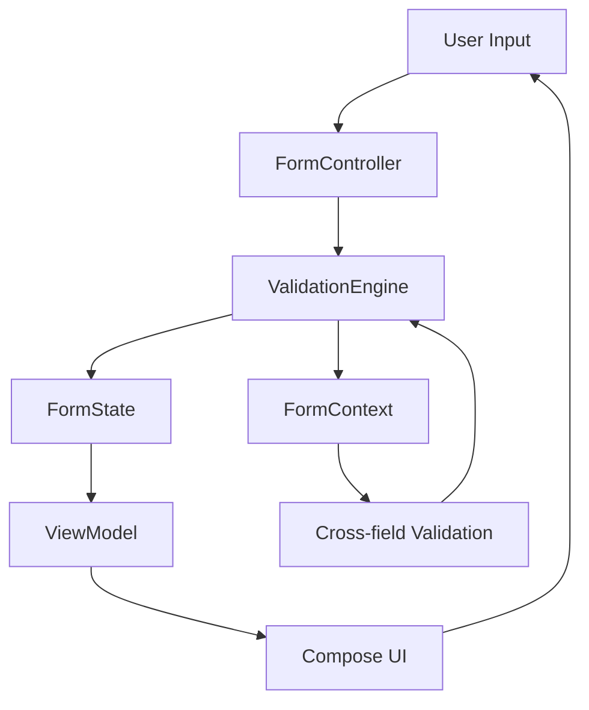

# 📋 Form System Documentation

## 📖 תוכן עניינים
- [סקירה כללית](#סקירה-כללית)
- [ארכיטקטורה](#ארכיטקטורה)
- [התקנה ושימוש](#התקנה-ושימוש)
- [API Reference](#api-reference)
- [דוגמאות שימוש](#דוגמאות-שימוש)
- [מדריך מתקדם](#מדריך-מתקדם)
- [Best Practices](#best-practices)

---

## 🎯 סקירה כללית

**Form System** הוא מנוע טפסים מתקדם ב-Kotlin המיועד לעבודה עם Jetpack Compose. המערכת מספקת:

- ✅ **DSL פשוט ונקי** ליצירת טפסים
- ✅ **ולידציה חכמה** עם תמיכה ב-cross-field validation
- ✅ **ניהול State אוטומטי**
- ✅ **ולידטורים ישראליים** מובנים (ת.ז, טלפון)
- ✅ **אינטגרציה חלקה** עם ViewModel ו-Compose
- ✅ **Type Safety** מלא

### 🏗️ תכונות מרכזיות

| תכונה | תיאור |
|--------|-------|
| **Declarative DSL** | הגדרת טפסים בצורה דקלרטיבית וקריאה |
| **Real-time Validation** | ולידציה מיידית בזמן הקלדה |
| **Cross-field Rules** | כללים שתלויים בשדות אחרים |
| **Type Safety** | שימוש ב-Generics לבטיחות טיפוסים |
| **Israeli Validators** | ולידטורים מותאמים לישראל |
| **Compose Integration** | קומפוננטות מוכנות לשימוש |

---

## 🏛️ ארכיטקטורה

### 📊 דיאגרמת שכבות

```
┌─────────────────────────────────────┐
│           COMPOSE LAYER             │
│   AddEmployeeScreen, FormFields    │
└─────────────────────────────────────┘
                  │
┌─────────────────────────────────────┐
│          VIEWMODEL LAYER            │
│  FormViewModel, EmployeeFormViewModel│
└─────────────────────────────────────┘
                  │
┌─────────────────────────────────────┐
│         CONTROLLER LAYER            │
│          FormController             │
└─────────────────────────────────────┘
                  │
┌─────────────────────────────────────┐
│            DSL LAYER                │
│     FormBuilder, FieldBuilder       │
└─────────────────────────────────────┘
                  │
┌─────────────────────────────────────┐
│           CORE LAYER                │
│ FormSchema, FieldDefinition, etc.   │
└─────────────────────────────────────┘
```

### 🔄 זרימת נתונים



---

## 🚀 התקנה ושימוש

### צעד 1: יצירת סכמת טופס

```kotlin
val userFormSchema = form("user-registration") {
    field<String>("fullName", FieldType.TEXT, required = true) {
        minLength(2)
        maxLength(50)
    }
    
    field<String>("email", FieldType.EMAIL, required = true) {
        email()
    }
    
    field<String>("phone", FieldType.PHONE) {
        israeliPhone()
    }
    
    field<String>("idNumber", FieldType.TEXT, required = true) {
        israeliId()
    }
}
```

### צעד 2: יצירת ViewModel

```kotlin
class UserFormViewModel : FormViewModel<UserFormState>(userFormSchema) {
    
    override fun createInitialFormState(): UserFormState {
        return UserFormState()
    }
    
    override fun updateFormState() {
        // עדכון ה-State בהתאם לנתוני הטופס
    }
    
    override fun onFormSubmit(data: Map<String, Any?>) {
        // טיפול בשליחת הטופס
    }
}
```

### צעד 3: שימוש ב-Compose

```kotlin
@Composable
fun UserRegistrationScreen(viewModel: UserFormViewModel) {
    val state by viewModel.formState.collectAsState()
    
    Column {
        FormTextField(
            controller = viewModel,
            fieldId = "fullName",
            label = "שם מלא"
        )
        
        FormTextField(
            controller = viewModel,
            fieldId = "email", 
            label = "אימייל"
        )
        
        Button(
            onClick = { viewModel.submitForm() },
            enabled = state.canSubmit()
        ) {
            Text("שלח")
        }
    }
}
```

---

## 📚 API Reference

### Core Classes

#### 🏗️ FormSchema

**תיאור:** מכיל את כל הגדרות הטופס והשדות

```kotlin
data class FormSchema(
    val id: String,
    val fields: Map<String, FieldDefinition<*>>
)
```

**מתודות עיקריות:**

| מתודה | תיאור | החזרה |
|-------|-------|-------|
| `getField<T>(fieldId: String)` | מחזיר הגדרת שדה | `FieldDefinition<T>?` |
| `validateSchema()` | בודק תקינות הסכמה | `ValidationResult` |

---

#### 🎯 FieldDefinition<T>

**תיאור:** הגדרת שדה בודד עם כל המאפיינים שלו

```kotlin
data class FieldDefinition<T>(
    val id: String,
    val type: FieldType,
    val defaultValue: T? = null,
    val required: Boolean = false,
    val validators: List<Validator<T>> = emptyList()
)
```

**מתודות עיקריות:**

| מתודה | תיאור | פרמטרים |
|-------|-------|----------|
| `validate(value, context)` | מריץ ולידציה על הערך | `value: T?`, `context: ValidationContext` |
| `isVisible(formState)` | בודק אם השדה גלוי | `formState: Map<String, Any?>` |
| `isEditable(permissions)` | בודק אם השדה ניתן לעריכה | `permissions: Set<Permission>` |

---

#### 🔧 FormController

**תיאור:** הבקר המרכזי המנהל את הטופס

```kotlin
class FormController(private val schema: FormSchema)
```

**מתודות עיקריות:**

| מתודה | תיאור | פרמטרים | החזרה |
|-------|-------|----------|-------|
| `updateField<T>(fieldId, value)` | מעדכן ערך שדה ומריץ ולידציה | `fieldId: String`, `value: T?` | `Unit` |
| `validateField<T>(fieldId, value)` | מריץ ולידציה על שדה ספציפי | `fieldId: String`, `value: T?` | `Unit` |
| `validateAll()` | מריץ ולידציה על כל השדות | - | `Boolean` |
| `submit()` | מגיש את הטופס אם תקין | - | `Map<String, Any?>` |

**דוגמה:**
```kotlin
val controller = FormController(schema)
controller.updateField("email", "user@example.com")
val isValid = controller.validateAll()
if (isValid) {
    val data = controller.submit()
}
```

---

#### 📊 FormState

**תיאור:** מחזיק את state הטופס - ערכים, שגיאות, מצב touched

```kotlin
class FormState {
    private val _values = mutableMapOf<String, Any?>()
    private val _errors = mutableMapOf<String, String?>()
    private val _touched = mutableMapOf<String, Boolean>()
}
```

**מתודות עיקריות:**

| מתודה | תיאור | פרמטרים | החזרה |
|-------|-------|----------|-------|
| `getValue<T>(fieldId)` | מחזיר ערך שדה | `fieldId: String` | `T?` |
| `setValue<T>(fieldId, value)` | מגדיר ערך שדה | `fieldId: String`, `value: T?` | `Unit` |
| `getError(fieldId)` | מחזיר שגיאת שדה | `fieldId: String` | `String?` |
| `setError(fieldId, error)` | מגדיר שגיאת שדה | `fieldId: String`, `error: String?` | `Unit` |
| `hasErrors()` | בודק אם יש שגיאות | - | `Boolean` |
| `isTouched(fieldId)` | בודק אם השדה נגע | `fieldId: String` | `Boolean` |

---

### DSL API

#### 🏗️ FormBuilder

**תיאור:** Builder ליצירת טפסים באמצעות DSL

**דוגמה מלאה:**
```kotlin
val complexForm = form("complex-form") {
    // שדה טקסט פשוט
    field<String>("name", FieldType.TEXT, required = true) {
        minLength(2)
        maxLength(50)
        custom("השם חייב להכיל רק אותיות") { name, _ ->
            name?.all { it.isLetter() || it.isWhitespace() } ?: true
        }
    }
    
    // שדה אימייל
    field<String>("email", FieldType.EMAIL, required = true) {
        email()
        custom("האימייל לא יכול להיות זהה לשם") { email, context ->
            val name = context.getValue<String>("name")
            email?.lowercase() != name?.lowercase()
        }
    }
    
    // שדה סיסמה עם ולידציה מורכבת
    field<String>("password", FieldType.PASSWORD, required = true) {
        minLength(8)
        custom("הסיסמה חייבת להכיל אות גדולה, קטנה ומספר") { password, _ ->
            password?.let { p ->
                p.any { it.isUpperCase() } &&
                p.any { it.isLowerCase() } &&
                p.any { it.isDigit() }
            } ?: false
        }
    }
    
    // אישור סיסמה עם cross-field validation
    field<String>("confirmPassword", FieldType.PASSWORD, required = true) {
        custom("הסיסמאות אינן תואמות") { confirmPassword, context ->
            val password = context.getValue<String>("password")
            confirmPassword == password
        }
    }
}
```

#### 🎯 FieldBuilder<T>

**מתודות ולידציה מובנות:**

| מתודה | תיאור | פרמטרים |
|-------|-------|----------|
| `required()` | שדה חובה | - |
| `minLength(min)` | אורך מינימלי | `min: Int` |
| `maxLength(max)` | אורך מקסימלי | `max: Int` |
| `email()` | פורמט אימייל | - |
| `israeliPhone()` | מספר טלפון ישראלי | - |
| `israeliId()` | תעודת זהות ישראלית | - |
| `minValue(min)` | ערך מינימלי | `min: Double` |
| `maxValue(max)` | ערך מקסימלי | `max: Double` |
| `custom(message, predicate)` | ולידציה מותאמת | `message: String`, `predicate: (T?, ValidationContext) -> Boolean` |

---

### Validation API

#### ✅ Validator<T>

**תיאור:** ממשק לולידטור

```kotlin
fun interface Validator<T> {
    fun validate(
        value: T?, 
        field: FieldDefinition<T>, 
        context: ValidationContext
    ): ValidationResult
}
```

#### 📝 ValidationResult

**תיאור:** תוצאת ולידציה

```kotlin
data class ValidationResult(
    val isValid: Boolean,
    val errorMessage: String? = null
)
```

**מתודות סטטיות:**
```kotlin
ValidationResult.success()                    // הצלחה
ValidationResult.error("הודעת שגיאה")         // שגיאה
```

#### 🇮🇱 CommonValidators

**ולידטורים ישראליים מובנים:**

```kotlin
// ולידטור תעודת זהות ישראלית
CommonValidators.israeliId()

// ולידטור טלפון ישראלי (05X-XXXXXXX)
CommonValidators.israeliPhone()

// ולידטורים כלליים
CommonValidators.required()
CommonValidators.email()
CommonValidators.minLength(5)
CommonValidators.maxLength(20)
CommonValidators.minValue(0.0)
CommonValidators.maxValue(100.0)
```

---

### ViewModel Integration

#### 🏗️ FormViewModel<T>

**תיאור:** ViewModel בסיסי לטפסים

```kotlin
abstract class FormViewModel<T>(
    private val formSchema: FormSchema
) : ViewModel() {
    
    protected abstract fun createInitialFormState(): T
    protected abstract fun updateFormState()
    protected abstract fun onFormSubmit(data: Map<String, Any?>)
}
```

**מתודות זמינות:**

| מתודה | תיאור | פרמטרים |
|-------|-------|----------|
| `updateField(fieldId, value)` | עדכון שדה | `fieldId: String`, `value: Any?` |
| `validateForm()` | ולידציה מלאה | - |
| `submitForm()` | הגשת טופס | - |
| `getFieldValue(fieldId)` | קבלת ערך שדה | `fieldId: String` |
| `getFieldError(fieldId)` | קבלת שגיאת שדה | `fieldId: String` |
| `hasErrors()` | בדיקת שגיאות | - |

---

## 🎨 דוגמאות שימוש

### 📋 טופס רישום בסיסי

```kotlin
val registrationForm = form("registration") {
    field<String>("fullName", FieldType.TEXT, required = true) {
        minLength(2)
        maxLength(100)
    }
    
    field<String>("email", FieldType.EMAIL, required = true) {
        email()
    }
    
    field<String>("phone", FieldType.PHONE) {
        israeliPhone()
    }
    
    field<Boolean>("agreeToTerms", FieldType.CHECKBOX, required = true) {
        custom("חובה להסכים לתנאי השימוש") { agreed, _ ->
            agreed == true
        }
    }
}
```

### 🏢 טופס עובד מתקדם

```kotlin
val employeeForm = form("employee") {
    // פרטים אישיים
    field<String>("firstName", FieldType.TEXT, required = true) {
        minLength(2)
        maxLength(50)
        custom("שם פרטי חייב להכיל רק אותיות עבריות או אנגליות") { name, _ ->
            name?.all { it.isLetter() || it.isWhitespace() } ?: true
        }
    }
    
    field<String>("lastName", FieldType.TEXT, required = true) {
        minLength(2)
        maxLength(50)
    }
    
    field<String>("idNumber", FieldType.TEXT, required = true) {
        israeliId()
    }
    
    // פרטי קשר
    field<String>("email", FieldType.EMAIL, required = true) {
        email()
        custom("כתובת האימייל חייבת להיות של החברה") { email, _ ->
            email?.endsWith("@company.com") ?: false
        }
    }
    
    field<String>("phone", FieldType.PHONE, required = true) {
        israeliPhone()
    }
    
    field<String>("emergencyContact", FieldType.PHONE) {
        israeliPhone()
        custom("איש קשר לחירום חייב להיות שונה מהטלפון הרגיל") { emergency, context ->
            val regularPhone = context.getValue<String>("phone")
            emergency != regularPhone
        }
    }
    
    // פרטי עבודה
    field<String>("department", FieldType.SELECT, required = true)
    
    field<String>("position", FieldType.TEXT, required = true) {
        minLength(2)
        maxLength(100)
    }
    
    field<Double>("salary", FieldType.NUMBER, required = true) {
        minValue(5000.0)
        maxValue(50000.0)
    }
    
    field<LocalDate>("startDate", FieldType.DATE, required = true) {
        custom("תאריך התחלה לא יכול להיות בעבר") { date, _ ->
            date?.isAfter(LocalDate.now()) ?: false
        }
    }
    
    // הרשאות
    field<List<String>>("permissions", FieldType.MULTI_SELECT) {
        custom("חייב לבחור לפחות הרשאה אחת") { permissions, _ ->
            permissions?.isNotEmpty() ?: false
        }
    }
}
```

### 🏦 טופס פיננסי עם ולידציה מורכבת

```kotlin
val loanApplicationForm = form("loan-application") {
    // פרטי הלוואה
    field<Double>("loanAmount", FieldType.CURRENCY, required = true) {
        minValue(10000.0)
        maxValue(1000000.0)
        custom("סכום ההלוואה חייב להיות כפולה של 1000") { amount, _ ->
            amount?.rem(1000) == 0.0
        }
    }
    
    field<Int>("loanTermMonths", FieldType.NUMBER, required = true) {
        minValue(12.0)
        maxValue(360.0)
        custom("תקופת ההלוואה חייבת להיות כפולה של 12") { months, _ ->
            months?.rem(12) == 0
        }
    }
    
    // הכנסות
    field<Double>("monthlyIncome", FieldType.CURRENCY, required = true) {
        minValue(5000.0)
        custom("ההכנסה חייבת להיות לפחות פי 3 מהתשלום החודשי") { income, context ->
            val loanAmount = context.getValue<Double>("loanAmount") ?: 0.0
            val termMonths = context.getValue<Int>("loanTermMonths") ?: 1
            val monthlyPayment = loanAmount / termMonths
            income != null && income >= monthlyPayment * 3
        }
    }
    
    field<Double>("additionalIncome", FieldType.CURRENCY) {
        minValue(0.0)
        custom("הכנסה נוספת לא יכולה להיות גבוהה מההכנסה הרגילה") { additional, context ->
            val mainIncome = context.getValue<Double>("monthlyIncome") ?: 0.0
            additional?.let { it <= mainIncome } ?: true
        }
    }
    
    // התחייבויות
    field<Double>("existingDebt", FieldType.CURRENCY) {
        minValue(0.0)
        custom("החוב הקיים לא יכול להיות יותר מ-40% מההכנסה") { debt, context ->
            val income = context.getValue<Double>("monthlyIncome") ?: 0.0
            debt?.let { it <= income * 0.4 } ?: true
        }
    }
    
    // ערבויות
    field<Boolean>("hasGuarantor", FieldType.CHECKBOX)
    
    field<String>("guarantorId", FieldType.TEXT) {
        israeliId()
        custom("ת.ז. ערב נדרשת אם יש ערב") { guarantorId, context ->
            val hasGuarantor = context.getValue<Boolean>("hasGuarantor") ?: false
            if (hasGuarantor) {
                guarantorId?.isNotBlank() ?: false
            } else {
                true
            }
        }
    }
}
```

---

## 🔧 מדריך מתקדם

### Cross-Field Validation

**דוגמה לולידציה בין שדות:**

```kotlin
form("advanced-validation") {
    field<LocalDate>("birthDate", FieldType.DATE, required = true)
    
    field<LocalDate>("passportExpiry", FieldType.DATE, required = true) {
        custom("דרכון חייב להיות תקף לפחות 6 חודשים") { expiry, context ->
            val birthDate = context.getValue<LocalDate>("birthDate")
            val minAge = LocalDate.now().minusYears(18)
            
            expiry?.let { exp ->
                birthDate?.let { birth ->
                    birth.isBefore(minAge) && exp.isAfter(LocalDate.now().plusMonths(6))
                } ?: false
            } ?: false
        }
    }
    
    field<String>("password", FieldType.PASSWORD, required = true) {
        minLength(8)
    }
    
    field<String>("confirmPassword", FieldType.PASSWORD, required = true) {
        custom("אישור סיסמה חייב להיות זהה") { confirm, context ->
            val password = context.getValue<String>("password")
            confirm == password
        }
    }
}
```

### Custom Validators מתקדמים

```kotlin
// ולידטור מותאם לתאריך לידה
fun birthDateValidator() = Validator<LocalDate?> { value, field, context ->
    when {
        value == null -> ValidationResult.success()
        value.isAfter(LocalDate.now()) -> 
            ValidationResult.error("תאריך לידה לא יכול להיות בעתיד")
        value.isBefore(LocalDate.now().minusYears(120)) -> 
            ValidationResult.error("תאריך לידה לא הגיוני")
        value.isAfter(LocalDate.now().minusYears(18)) -> 
            ValidationResult.error("חייב להיות מעל גיל 18")
        else -> ValidationResult.success()
    }
}

// שימוש:
field<LocalDate>("birthDate", FieldType.DATE, required = true) {
    validator(birthDateValidator())
}
```

### Conditional Fields

```kotlin
form("conditional-form") {
    field<String>("userType", FieldType.SELECT, required = true)
    
    field<String>("companyName", FieldType.TEXT) {
        custom("שם חברה נדרש עבור משתמש עסקי") { companyName, context ->
            val userType = context.getValue<String>("userType")
            if (userType == "BUSINESS") {
                companyName?.isNotBlank() ?: false
            } else {
                true // לא נדרש עבור משתמש פרטי
            }
        }
    }
    
    field<String>("taxId", FieldType.TEXT) {
        custom("מספר עוסק נדרש עבור משתמש עסקי") { taxId, context ->
            val userType = context.getValue<String>("userType")
            if (userType == "BUSINESS") {
                taxId?.matches(Regex("\\d{9}")) ?: false
            } else {
                true
            }
        }
    }
}
```

---

## ✨ Best Practices

### 🎯 עיצוב טפסים

1. **קבץ שדות קשורים יחד:**
```kotlin
form("user-profile") {
    // קבוצת פרטים אישיים
    field<String>("firstName", FieldType.TEXT, required = true)
    field<String>("lastName", FieldType.TEXT, required = true)
    field<String>("idNumber", FieldType.TEXT, required = true)
    
    // קבוצת פרטי קשר
    field<String>("email", FieldType.EMAIL, required = true)
    field<String>("phone", FieldType.PHONE)
    field<String>("address", FieldType.TEXT)
}
```

2. **השתמש בהודעות שגיאה ברורות:**
```kotlin
field<String>("password", FieldType.PASSWORD, required = true) {
    custom("הסיסמה חייבת להכיל: 8+ תווים, אות גדולה, אות קטנה, מספר וסימן מיוחד") { password, _ ->
        password?.let { p ->
            p.length >= 8 &&
            p.any { it.isUpperCase() } &&
            p.any { it.isLowerCase() } &&
            p.any { it.isDigit() } &&
            p.any { !it.isLetterOrDigit() }
        } ?: false
    }
}
```

3. **ולידציה הדרגתית:**
```kotlin
field<String>("email", FieldType.EMAIL, required = true) {
    // ולידציה בסיסית
    required()
    email()
    
    // ולידציה מתקדמת
    custom("האימייל כבר קיים במערכת") { email, context ->
        // כאן תבדוק מול מסד הנתונים
        !isEmailExists(email)
    }
}
```

### 🚀 ביצועים

1. **הימנע מולידציה כבדה ב-onChange:**
```kotlin
field<String>("username", FieldType.TEXT, required = true) {
    // ולידציה מהירה
    minLength(3)
    maxLength(20)
    
    // ולידציה כבדה - רק בסיום הקלדה
    custom("שם משתמש כבר תפוס") { username, _ ->
        // השתמש ב-debounce או בדוק רק ב-onBlur
        checkUsernameAvailability(username)
    }
}
```

2. **Cache תוצאות ולידציה:**
```kotlin
private val validationCache = mutableMapOf<String, ValidationResult>()

fun expensiveValidator() = Validator<String?> { value, field, context ->
    val cacheKey = "${field.id}:$value"
    validationCache[cacheKey] ?: run {
        val result = performExpensiveValidation(value)
        validationCache[cacheKey] = result
        result
    }
}
```

### 🧪 בדיקות

```kotlin
@Test
fun `test email validation`() {
    val schema = form("test") {
        field<String>("email", FieldType.EMAIL, required = true) {
            email()
        }
    }
    
    val controller = FormController(schema)
    
    // בדיקת אימייל תקין
    controller.updateField("email", "test@example.com")
    assertTrue(controller.validateAll())
    
    // בדיקת אימייל לא תקין
    controller.updateField("email", "invalid-email")
    assertFalse(controller.validateAll())
    assertEquals("כתובת אימייל לא תקינה", controller.state.getError("email"))
}

@Test
fun `test cross-field validation`() {
    val schema = form("test") {
        field<String>("password", FieldType.PASSWORD, required = true)
        field<String>("confirmPassword", FieldType.PASSWORD, required = true) {
            custom("הסיסמאות אינן תואמות") { confirm, context ->
                val password = context.getValue<String>("password")
                confirm == password
            }
        }
    }
    
    val controller = FormController(schema)
    
    controller.updateField("password", "test123")
    controller.updateField("confirmPassword", "test123")
    assertTrue(controller.validateAll())
    
    controller.updateField("confirmPassword", "different")
    assertFalse(controller.validateAll())
}
```

### 📱 אינטגרציה עם Compose

```kotlin
@Composable
fun FormTextField(
    controller: FormController,
    fieldId: String,
    label: String,
    keyboardType: KeyboardType = KeyboardType.Text,
    modifier: Modifier = Modifier
) {
    val value = controller.state.getValue<String>(fieldId) ?: ""
    val error = controller.state.getError(fieldId)
    val isTou